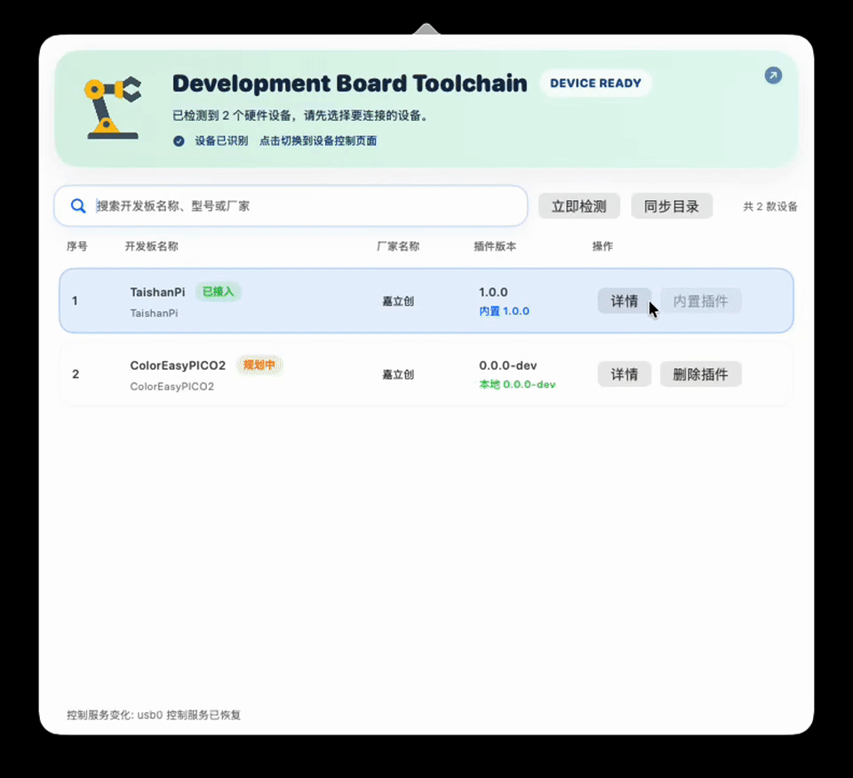

# development-board-toolchain

Open-source macOS GUI project for `DBT-Agent`.

This repository contains the menu bar application source, the supporting Swift CLI sources it validates against during build, and GitHub Actions for build and release packaging.

## Demo

Click the preview below to open the original WebM recording.

[](assets/demo/gui_demo.webm)

## Scope

- GUI app bundle name: `DBT-Agent.app`
- GUI in-app title: `Development Board Toolchain`
- Release archive: `DBT-Agent-<version>.zip`

This repository builds and releases the GUI application package.

Runtime, local `dbt-agentd`, board plugin content, and private product release orchestration remain outside this repository.

## Licensing

This repository is released under the MIT License.

Use, modification, redistribution, and commercial use are allowed, provided the original copyright notice and license text are retained.

## Project Layout

- `mac_app/gui`
  - `DevelopmentBoardToolchainGUI.swift`
  - `build_gui_app.sh`
- `mac_app/swift-cli`
  - Swift CLI sources used for local compatibility validation during GUI build
- `assets`
  - app icon and bundled GUI assets
- `scripts`
  - release packaging helpers
- `.github/workflows`
  - CI build and tagged release workflows

## Local Build

```bash
./mac_app/gui/build_gui_app.sh
```

Build output:

- `mac_app/gui/build/DBT-Agent.app`
- `mac_app/gui/build/DBT-Agent-<version>.zip`

## Local Release Packaging

```bash
./scripts/package_gui_release.sh
```

Release output:

- `dist/gui_app/DBT-Agent-<version>.zip`
- `dist/gui_app/manifest.json`
- `dist/gui_app/toolkit-manifest.json`

The GUI release package contains the application bundle only.

It does **not** bundle:

- `dbtctl`
- `dbt-agentd`
- shared runtime payloads
- hardware operation toolchains

Those are installed and updated separately under `~/Library/Application Support/development-board-toolchain`.

Optional environment variables:

- `APP_VERSION_OVERRIDE`
- `APP_BUILD`
- `DOWNLOAD_BASE_URL`

## GitHub Actions

- `build.yml`
  - Builds the GUI on push and pull request
- `release.yml`
  - Builds and publishes release assets on tag push `v*`

## Notes

- The GUI is designed to work with the shared local install root under `~/Library/Application Support/development-board-toolchain`.
- The app itself does not bundle the full runtime or `dbt-agentd`; those are installed and updated separately by the product runtime.
